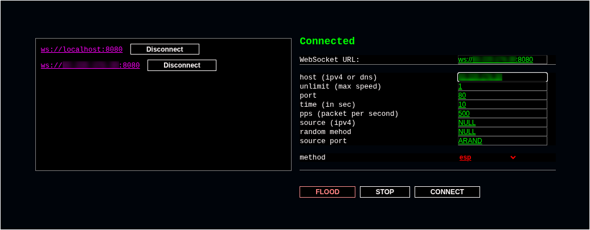

<div align="center">
<h1 align="center">flood.c</h1>
 <p align="center">
Insanely fast stress-test L4, runs on TPACKETV3; supports many methods; control panel in HTML.
</p>
 


</div>

<h1 align="center">Compile</h1>

Successful compilation is only possible on linux, and only if you have the library, libwebsockets (needed for the panel) installed. You can install the library like this,
```
sudo apt install libwebsockets-dev
sudo pacman -S libwebsockets
```
then compile flood.c like this,
```
git clone --depth=1 https://github.com/Lomasterrrr/flood.c.git
cd flood.c
./configure
make -j
```

<h1 align="center">Usage</h1>

After successful compilation, you will have a `run.sh` file in your folder and you should run it,
```
sudo ./run.sh
```
Now in the new terminal, since this one is occupied by `run.sh`, you need to open `panel.html` with a browser.
```
cd flood.c  (since we're in a new terminal)

google-chrome-stable panel.html
firefox panel.html
```
It should then automatically connect to your `localhost`. Now you can start testing your network.

<h2 align="center">Format fields</h2>

It is worth considering that all values of type `string`, (for example the value in the `target` field), must be specified in quotation marks, as below,

```
'myhost'
"my server"
```

And to read more about it, see the chapter below `Config`. For the format of the `<value>` record in the config, is similar to their record in html.

<h2 align="center">Connect</h2>

To connect another server, if you want to seriously test your server, you should open port `8080` on the remote host, and `run.sh`. Then, in your `panel.html`, you should type the address of this host in the field, `WebSocket URL`, and click the `CONNECT` button. Here's an example of a URL entry,

```
ws://8.9.3.4:8080
ws://142.33.33.33:8080
...,
```

<h1 align="center">Speed test</h1>

Using config/defaultcfg,

```
460k packet per second
```

While t50, shows on the same host,

```
130k packet per second
```

And blitzping shows
```
300-350k packet per second
```

And hping3,
```
30k packet per second
```


<h1 align="center">Master usage</h1>

You do not have to use `panel.html` to use it. You can use the `FLOOD` program in the same folder.
It should be given a config (such as the one in `config/defaultcfg`) as an argument, and it will start your stress test.

For `Mater usage` you need to know the configs; a config contains two elements (1) instruction (2) comment.

<h2 align="center">Instruction</h2>

The instructions are as follows,
```
<name>=<value>;
```
It consists of 2 tokens, i.e. `=` and `;`. And two operands `name` `value`.

### Name

`<name>` is the name (identifier) of the option to which `<value>` is assigned.

### Value

`<value>` is what is assigned to `<name>`. However, it is worth noting that, “what is assigned” can be of different types; more specifically, `number`, `string`, `keyword`.

#### Number

`<value>` of the first type (i.e. of type `number`), is a number, and its assignment looks like this, (here we assign 100, pps options),
```
pps=100;
```

#### String

`<value>` of the first second type (`string`), is any, string, and it is assigned like this,
```
target="google.com";
```
or
```
target='google.com';
```
That is, unlike `number`, a `<value>` of type `string` must already be enclosed in quotation marks, either single or double.
Also, the symbols `=`,`;`,`‘`,`’`,`"`,`\`, must be specified, before the symbol `\`; for they are `special characters`.
So instead of just `=` we write it like this,
```
target='\='; 
```

#### Keyword

The third type `keyword`, represents any reserved word, `flood.c` perceives such words differently.
In total, there are 3 such words, `NULL`, `RAND`, `ARAND`.

The word `NULL` is specified as follows,
```
pps=NULL;
target=NULL;
```
This entry tells `flood.c` that the values of the `pps` and `target` options, should be default (or it should determine them automatically).

The second word, it's `ARAND`, the entry is like this,
```
source=ARAND;
```
Such an entry tells `flood.c` that the value of the `source` option, with each packet sent, should be a random value. That is, it must set the `source` parameter to a random value before sending EVERY packet.

The third word is `RAND`, it's written like this,
```
pps=RAND/1,10;
target=RAND/10,abcd
target=RAND/IPV4
target=RAND/DNS
```
This is where it's time to say that the options, `<name>`, can take either `number` and `keyword` or `string` and `keyword`.
For example, the `pps` option can only accept `<value>` of type - `number` or `keyword`. And the `target` option, values of type `string` or `keyword`.
So it will be said this way, the `pps` option is a `numeric option` and the `target` option is a `string option`.

So, here `numeric options` have this syntax `RAND`,
```
pps=RAND/1,10;
```
This tells `flood.c` that ONE SINGLE time at startup, it should set the `pps` option, as a value, to a random number between `1` and `10`.

And `string options` have this syntax `RAND`,
```
target=RAND/10,abcd
target=RAND/IPV4
target=RAND/DNS
```
The first entry tells `flood.c` ONE time at startup to specify a random string 10 characters long, from the abcd alphabet, as the value for the `target` field.
Second entry, specify a random IP 4 version address as the value.
Third entry, random DNS. (.com)

<h2 align="center">Comment</h2>

And the comment looks like this,
```
/* comment /* and comment */ */

/*
is
coom
  ** **** ent /* this */
*/
```
The beginning of a comment is asserted with the combination `/*` and the end of the comment with `*/`. Everything inside these characters is a comment.
